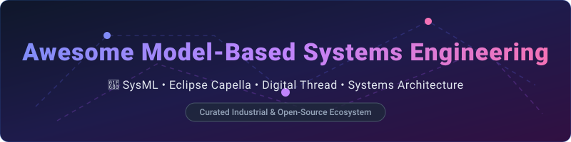

  

# 🚀 Awesome Model-Based Systems Engineering (MBSE) Ecosystem 🛠️

  
  
  
  

> A curated list of **Model-Based Systems Engineering (MBSE)** SaaS platforms, software tools, SysML modeling environments, and open-source GitHub projects.

Focused on **SysML Modeling, Architecture Design, Requirements Traceability, Digital Thread, and Complex Systems Engineering**.

---

## 📚 Table of Contents
- [📊 Industry Overview & Market Insights](#-industry-overview--market-insights)
- [🏢 SaaS & Commercial Enterprise Platforms](#-saas--commercial-enterprise-platforms)
- [💻 Open-Source GitHub Projects](#-open-source-github-projects)
- [🤝 How to Contribute](#-how-to-contribute)
- [💖 Support & Sponsorship](#-support--sponsorship)
- [📈 Star History](#-star-history)
- [⚠️ Disclaimer](#%EF%B8%8F-disclaimer)

---

## 📊 Industry Overview & Market Insights 💡

The global **Model-Based Systems Engineering (MBSE)** market size was estimated at **~$1.2 Billion in 2025** and is projected to reach **~$2.8 Billion by 2032** (CAGR ~12.5%). 

**Market Structure:** The sector is **moderately fragmented**. Key aerospace and defense enterprise leaders like **Dassault Systèmes** (Cameo/CATIA Magic), **Siemens**, **IBM**, and **PTC** dominate large enterprise deployments, while specialized web-native platforms (e.g., Valispace/Altium, Innoslate) and open-source standards (Eclipse Capella, SysML v2) serve growing niche and collaborative design teams.

---

## 🏢 SaaS & Commercial Enterprise Platforms 💼

Below is a curated comparison of leading commercial MBSE software platforms, ordered by **estimated parent company revenue / valuation** (descending):

| Platform / Tool 🛠️ | Parent / Company 🏛️ | Company Size (Rev / Val) 💰 | Starting Tier Price 🏷️ | Free Tier / Trial Limit ⏳ | Key Features & Focus 🎯 |
| :--- | :--- | :--- | :--- | :--- | :--- |
| **[IBM Engineering Systems Design Rhapsody](https://www.ibm.com/products/rhapsody)** | IBM | ~$61.8B annual revenue | Custom Enterprise Quote (~$3,500+/user) | Free Trial available upon request | SysML/UML modeling, embedded code generation, IBM DOORS lifecycle integration |
| **[Cameo Systems Modeler (CATIA Magic)](https://www.3ds.com/)** | Dassault Systèmes | ~$6.1B annual revenue ($45B+ cap) | ~$1,200 / user (Architect Edition) | **Free SysML v2 Community Edition** (limited to 500 major elements) | Industry standard SysML modeling, Teamwork Cloud, simulation integration |
| **[PTC Modeler](https://www.ptc.com/)** | PTC Inc. | ~$2.1B annual revenue | Custom Enterprise Quote (~$2,500+/user) | 30-day Free Trial available | SysML/UML architectural modeling integrated with Windchill PLM & ALM |
| **[Ansys ModelCenter](https://www.ansys.com/)** | Ansys (Synopsys) | ~$2.3B annual revenue | Custom Enterprise Quote (~$4,000+/user) | 30-day Free Trial for select modules | Multi-disciplinary trade studies, simulation integration & MBSE automation |
| **[Valispace (Altium Requirements Portal)](https://www.valispace.com/)** | Altium (Renesas) | ~$300M+ revenue ($9.1B acquisition) | **$995 / year** (Altium Develop Plan) | **30-day Free Trial** (no credit card required, unlimited collaborators) | Data-driven hardware requirements, parametric modeling & cloud collaboration |
| **[Sparx Enterprise Architect](https://sparxsystems.com/)** | Sparx Systems | Private (~$50M+ est. valuation) | **$245 one-time** (Professional Edition) | **30-day Free Trial** (full features with watermarked diagram exports) | Cost-effective SysML/UML architecture modeling & dynamic diagramming |
| **[Innoslate](https://www.innoslate.com/)** | SPEC Innovations | Private (~$15M+ est. valuation) | Custom Enterprise Quote (~$1,188/yr) | **Free Cloud Sandbox Account** (limited to 20 entities per project) | Cloud-native MBSE, SysML/LML modeling, DoDAF support & AI requirements |
| **[Vitech GENESYS](https://www.vitechcorp.com/)** | Zuken / Vitech | Private (Zuken: ~$250M revenue) | Custom Enterprise Quote (~$2,000+/user) | **30-day Academic / Evaluation Trial** upon sales request | End-to-end system architecture, behavioral modeling, verification & validation |

---

## 💻 Open-Source GitHub Projects 🔓

Below are prominent open-source MBSE tools, frameworks, and libraries, sorted by **GitHub Stars_Count** (descending):

| Project Name 📦 | GitHub Stars_Count ⭐ | Description 📝 |
| :--- | :--- | :--- |
| **[SysML-v2-Release](https://github.com/Systems-Modeling/SysML-v2-Release)** |  | Official OMG SysML v2 release specifications, standard domain libraries, and transformation models. |
| **[Eclipse Capella](https://github.com/eclipse-capella/capella)** |  | Leading industrial open-source MBSE workbench implementing the **Arcadia method** for system architecture design. |
| **[SysML-v2-Pilot-Implementation](https://github.com/Systems-Modeling/SysML-v2-Pilot-Implementation)** |  | Reference textual editor, parser, and graphical viewer for SysML v2. |
| **[SysML-v2-API-Services](https://github.com/Systems-Modeling/SysML-v2-API-Services)** |  | REST/HTTP API services and repositories for interchanging SysML v2 models. |
| **[capella-dockerimages](https://github.com/dbinfrago/capella-dockerimages)** |  | Containerized Docker environments for running Eclipse Capella headless or via web client. |
| **[py-capellambse](https://github.com/dbinfrago/py-capellambse)** |  | Python library for programmatic read/write access to Capella MBSE models in automated CI/CD pipelines. |
| **[capella-collab-manager](https://github.com/dbinfrago/capella-collab-manager)** |  | Cloud platform for managing collaborative multi-user sessions with Eclipse Capella in browser. |
| **[CADdrive](https://github.com/ghackenberg/CADdrive)** |  | Open-source platform for CAD and MBSE model version control and cloud collaboration. |

---

## 🤝 How to Contribute 🌟

Contributions are warmly welcome! Please follow these simple steps:
1. 🍴 **Fork** this repository.
2. 📝 **Add or edit** entries in `README.md` following the tabular format.
3. 🔍 Ensure links are active and pricing/star info is accurate.
4. 🚀 **Open a Pull Request** with a descriptive summary of changes.

---

## 💖 Support & Sponsorship ☕

If you find this repository helpful for your MBSE workflow, research, or systems architecture project, please consider supporting the project!

- ⭐ **Star** this repository to help others discover it.
- 🔄 **Fork** and share it with your engineering team or community.
- ☕ **Buy me a coffee / Sponsor**: Support ongoing maintenance on the [ Sponsor Dashboard](https://github.com/sponsors/ishandutta2007).

Thank you for being part of the open-source systems engineering community! 🙌

---

## 📈 Star History 📊

---

## ⚠️ Disclaimer 📜

- This is a **community-curated** list — not an official endorsement of any commercial platform.
- MBSE models often represent safety-critical or export-controlled systems. Tool selection, model security, and compliance management remain the sole responsibility of your engineering team.
